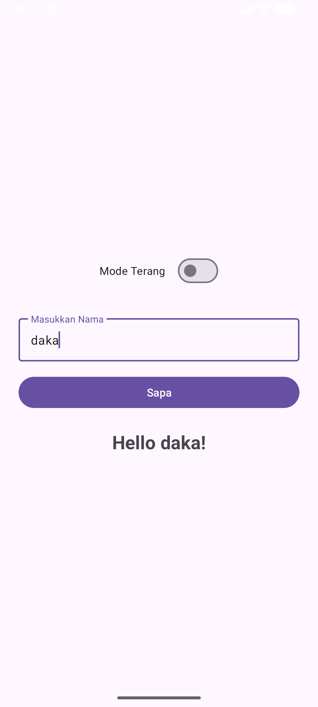
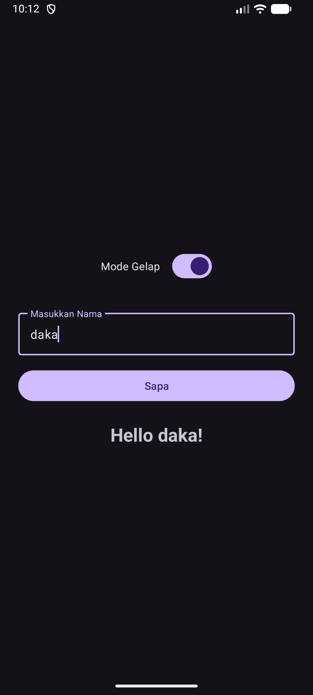

**Tugas Pemrograman Mobile**

Repository ini berisi source code tugas aplikasi Android sederhana menggunakan Kotlin dan XML.

## Identitas
* **Nama:** Badjradaka Herdinansyah Rahardjo
* **NIM:** 2410817210029

## Deskripsi Aplikasi
Aplikasi ini dibuat untuk memenuhi tugas pemrograman mobile. Fungsi utamanya adalah menerima input nama dari user dan menampilkannya dalam bentuk sapaan. Selain itu, aplikasi ini juga punya fitur untuk mengganti tema (Mode Gelap/Terang).

**Fitur:**
1. Input Nama.
2. Tombol "Sapa" untuk menampilkan teks "Hello [Nama]".
3. Switch untuk ganti Mode Gelap / Terang.

## Cara Menjalankan
1. Download atau Clone repository ini.
2. Buka **Android Studio**.
3. Pilih menu **Open** dan cari folder project ini.
4. Tunggu sampai proses *Gradle* selesai (pastikan ada internet).
5. Sambungkan HP atau nyalakan Emulator.
6. Klik tombol **Run** (segitiga hijau) di atas.

## Screenshot
Berikut adalah tampilan aplikasinya:
 
